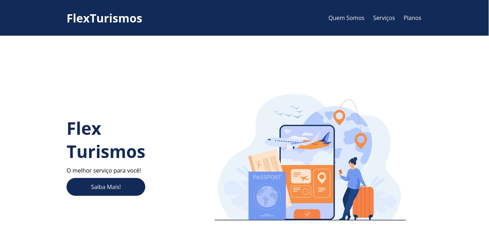

# DoctorCare

> Projeto front-end de landing page intitulada FlexTurismo desenvolvida durante o curso de Flexbox, pela [DIO](https://www.dio.me/).

> Teste o site:
> [FlexTurismo](https://artaugusto.github.io/FlexTurismo/)

## 📝 Licença

Esse projeto está sob licença. Veja o arquivo [LICENÇA](LICENSE) para mais detalhes.

[⬆ Voltar ao topo](#DoctorCare)
